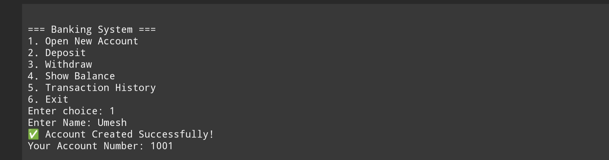
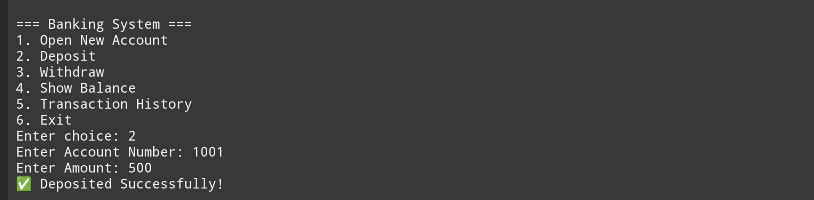
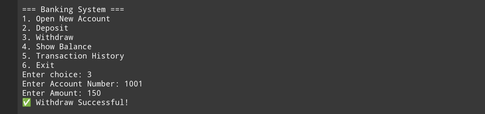
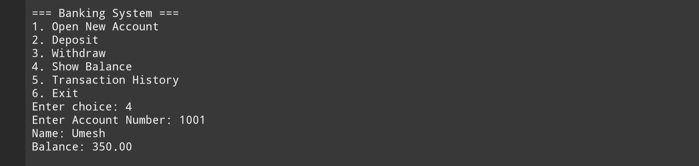
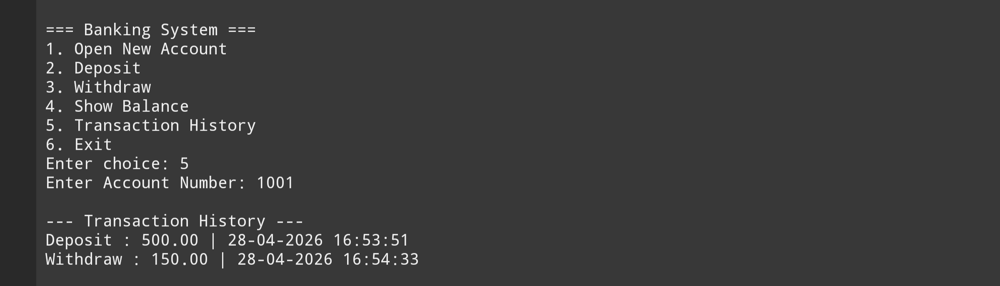

📌 Project Description

The Banking Transaction Manager is a console-based application that allows users to perform basic banking operations such as creating an account, depositing money, withdrawing money, and maintaining transaction history.

This project demonstrates the practical use of Linked Lists and Dynamic Memory Allocation in C.

🚀 Features

1.🆕 Create New Account (with auto-generated account number)

2.💰 Deposit Money

3.💸 Withdraw Money

4.📜 Maintain Transaction History

5.🔍 View Account Details

🛠️ Concepts Used

Linked List
Dynamic Memory Allocation (malloc, free)
Structures in C
Pointers

🧠 How It Works

Each account is stored as a node in a Linked List
Every transaction (deposit/withdrawal) is recorded in transaction history
Memory is dynamically allocated when a new account is created

📂 Project Structure

Banking-Transaction-Manager/
│
├── main.c
├── account.h
├── account.c
├── transaction.h
├── transaction.c
└── README.md

▶️ How to Run

Step 1: Compile
Bash
gcc main.c -o bank
Step 2: Run
Bash
./bank

📸 Sample Menu

1. Create Account
   
2. Deposit Money
   
3. Withdraw Money
   
4. Show Balance
  
5. View Transaction History

7. Exit

📈 Future Improvements

1.Add File Handling (to save data permanently)
2.Build a GUI (using C++ / Java / Web technologies)
3.Add Login System
4.Support Multiple Users

👨‍💻 Author

Umesh Pal

⭐ Note

This project is ideal for beginners who want to understand Data Structures and C programming through practical implementation.
